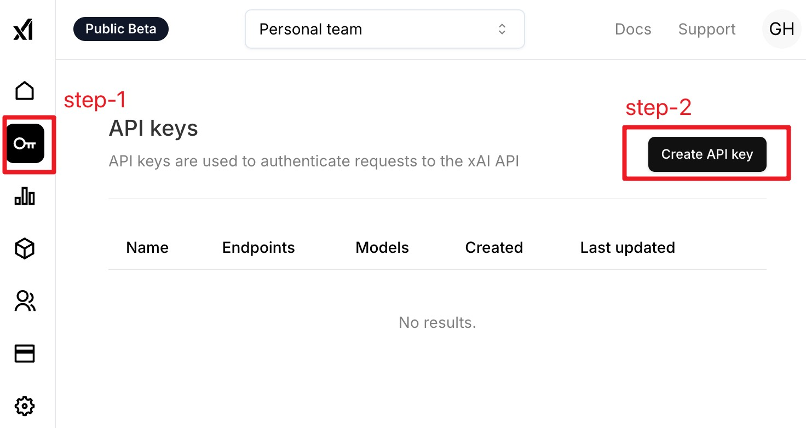

# README
在终端中使用xAI的grok-beta模型。

_Read this in other languages:_
[_简体中文_](README.md)

## Course Links

* [YouTube](https://youtu.be/Duolix5WOsA)
* [Bilibili](https://www.bilibili.com/video/BV1qsUxYaEpc/)

## How to use

1. Register an xAI account and log in to the console. Follow the steps shown in the image below to generate an API key.

2. Copy the generated API key.

3. Add the copied API key to the system's environment variables.

