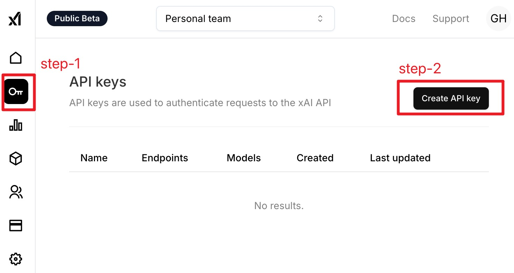
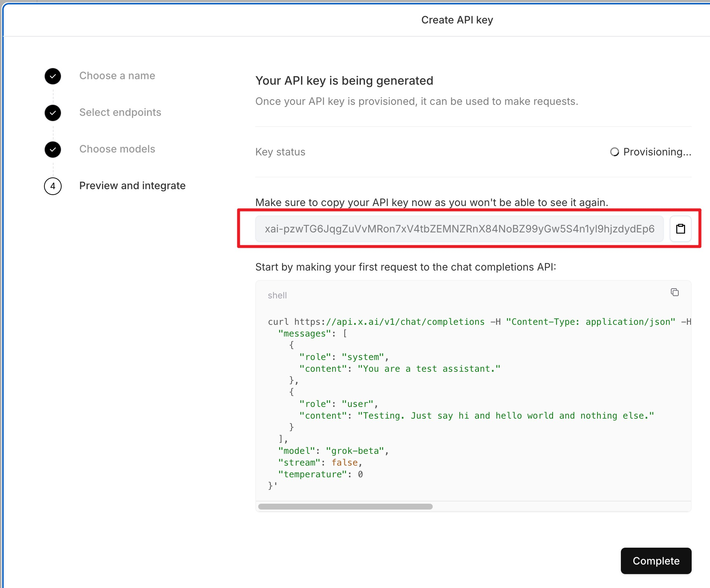
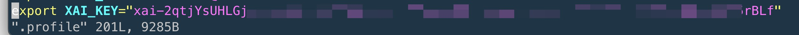

# README
在终端中使用xAI的grok-beta模型。

_Read this in other languages:_
[_English_](README.en-US.md)

## Course Links

* [YouTube](https://www.bilibili.com/video/BV1qsUxYaEpc/)
* [Bilibili](https://www.bilibili.com/video/BV1qsUxYaEpc/)

## How to use

1. 注册xAI账号，并登录到控制台，按照下图步骤操作来生成一个API key。

2. 复制生成的API key。

3. 将复制的API key添加到系统的环境变量中。

